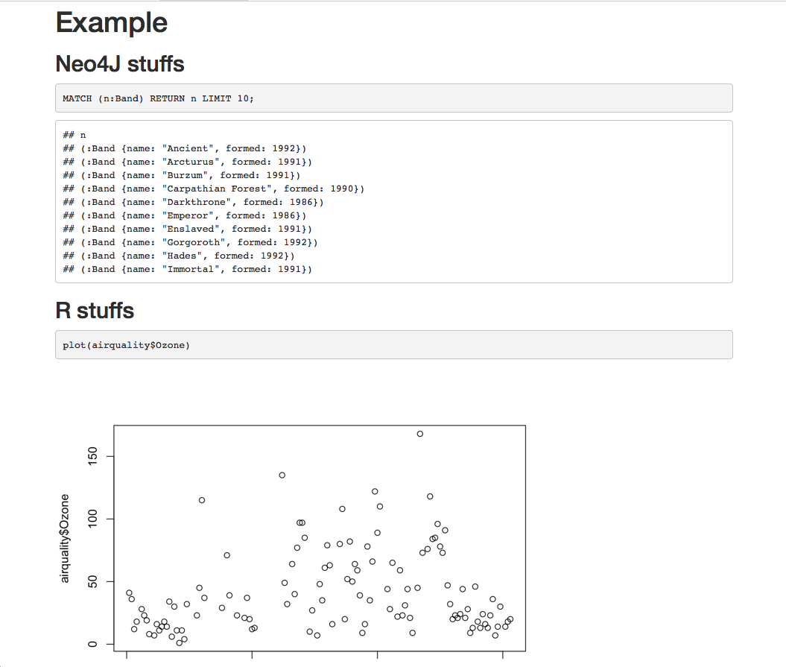

<!-- README.md is generated from README.Rmd. Please edit that file -->

[](https://www.tidyverse.org/lifecycle/#experimental)

Disclaimer: this package is still at an experimental level, and should
only be used for testing, bug reports, and enhancement requests.

This package has only been tested on these platforms for now, with the
files found in `inst/examples`, so it might not work on others :

  - neo4j 3.3.3
    
      - Mac OSX

  - neo4j 3.4.0-alpha08
    
      - Linux Mint
    
      - Windows 10

# rmd4j

The goal of {rmd4j} is to provide a knitr engine for running Neo4J
inside an RMarkdown

## Installation

You can install rmd4j from GitHub with:

``` r
# install.packages("remotes")
remotes::install_github("ThinkR-open/rmd4j")
```

## Before using

You need to have downloaded the neo4j [community
edition](https://neo4j.com/download/other-releases/), and have unpacked
it.

In order to use this knitr engine, you must have a running connection to
a Neo4J server, launched with `$NEO4J_HOME/bin/neo4j start`
($NEO4J\_HOME being the folder you’ve unpacked neo4j into).

Note to Windows users: you might need to specify your path with `\\`,
like `C:\\USers\\colin\\Documents\\neo4j\\bin\\cypher-shell.bat`.

## Test the package

If you want to test the package before using, there are two .Rmd inside
the inst/examples folder.

Add the path to you cypher bin, and test.

Any feedback is welcome\!

## Example

You can start a new document by take using the RMarkdown templates which
come with the configuration chunk.

If you want to add a Neo4J engine to an existing Rmarkdown, add the
`set_neo4j_engine` function inside the `setup` chunk in your RMarkdown.

If you follow the advices below about username and password, this should
only be
:

``` r
rmd4j::set_neo4j_engine(cypher_bin = "/Users/colin/soft/graphs/n4j/bin/cypher-shell")
```

*Note: if you’re a windows user, you need to specify the file extension
(should be .bat)*

But with more
customisation:

``` r
rmd4j::set_neo4j_engine(cypher_bin = "/Users/colin/soft/graphs/n4j/bin/cypher-shell", 
                        neo4j_user = "colin", 
                        neo4j_passwd = "pouetpouet", 
                        neo4j_adress = "bolt://localhost:7687")
```

You can set:

  - `cypher_bin` the path to your cypher-shell bin
  - `neo4j_user` your Neo4J username
  - `neo4j_passwd` your Neo4J username
  - `neo4j_format` the format of the output (either auto, verbose, or
    plain, default is “plain”)
  - `neo4j_adress` the url of the cluster, default is
    “bolt://localhost:7687”

As this chunk might contain some sensible information (like you
password), don’t forget to `{r setup, include=FALSE}` this chunk.

## The chunks

Neo4J chunks should start with a \`\`\``{neo4j}`.

You can run several Neo4J calls in the same chunk.

## About passwords and username

If you don’t specify any `neo4j_user` and `neo4j_passwd`,
`set_neo4J_engine()` will not use the `--user` and `--password` args of
the cypher-shell. In that case, you’ll need to have provided Neo4J your
user name and password, or have disabled the password request (see
below).

We strongly recommand to provide your Neo4J password outside of the rmd,
as it will prevent any unwanted share of these credentials.

### Disable Neo4J password request

Go to `$NEO4J_HOME/conf/neo4j.conf` and uncomment the line :
`dbms.security.auth_enabled=true`

### Create aliases (recommanded)

Add to your bash profile:

    export NEO4J_USERNAME='yourusername'
    export NEO4J_PASSWORD='yourpassword'

Via : [Neo4J Knowledge
base](https://neo4j.com/developer/kb/how-do-i-authenticate-with-cypher-shell-without-specifying-the-username-and-password-on-the-command-line/)

## Output

You can mix any other content (including R, of course), inside your
Rmarkdown :



## Example

Inside the package, you can find two examples in inst/examples.

Add the cypher bin path, and you’re good to go.

### Using github\_document as output :

From
[Rmd](https://github.com/ColinFay/neo4Jplayground/blob/master/colintracks.Rmd)
to
[md](https://github.com/ColinFay/neo4Jplayground/blob/master/colintracks.md).

## Contact

Questions and feedbacks [welcome](mailto:colin@thinkr.fr)\!

You want to contribute ? Open a
[PR](https://github.com/thinkr/rmd4j/pulls) :) If you encounter a bug or
want to suggest an enhancement, please [open an
issue](https://github.com/thinkr/rmd4j/issues).

Please note that this project is released with a [Contributor Code of
Conduct](CODE_OF_CONDUCT.md). By participating in this project you agree
to abide by its terms.
